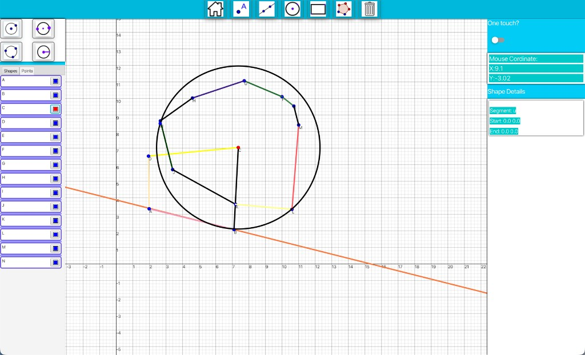
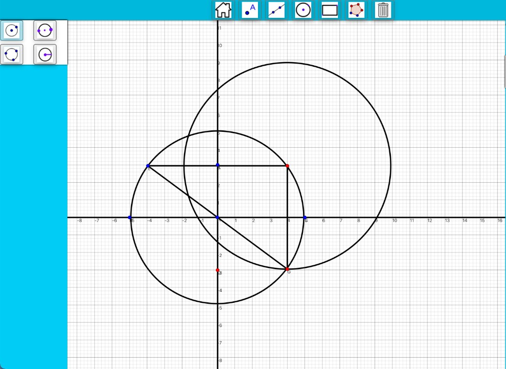
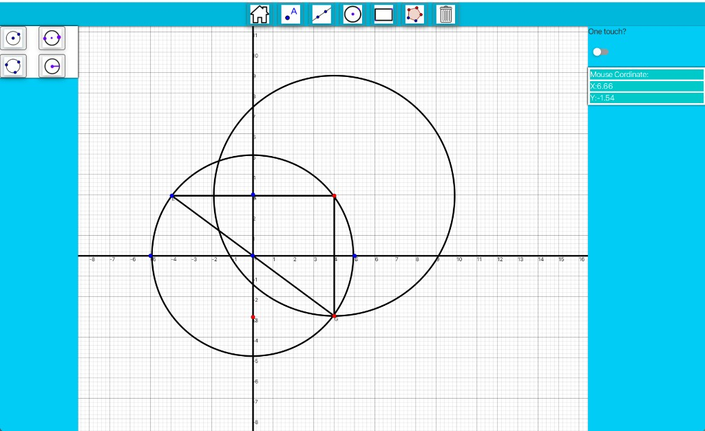
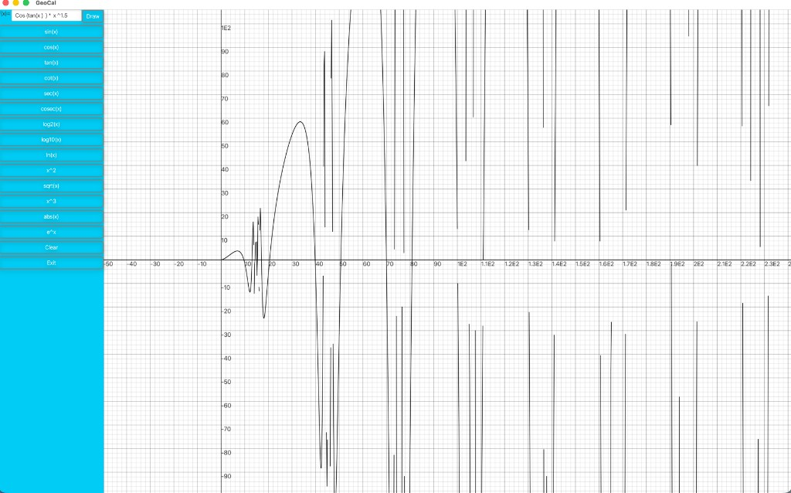
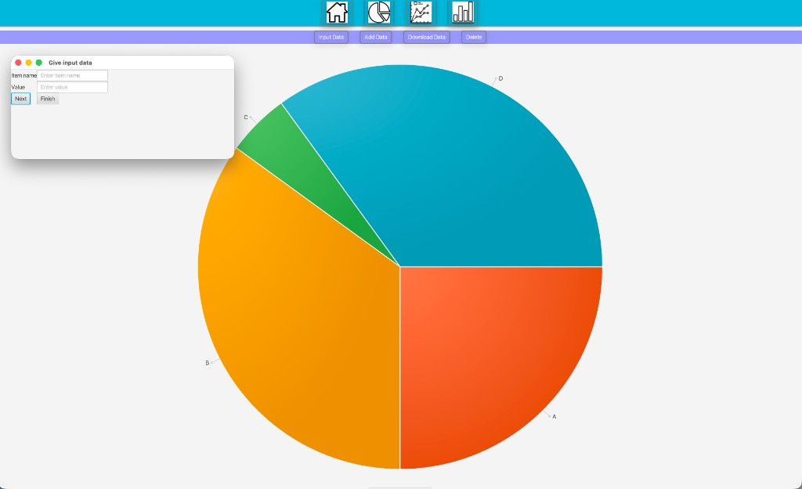
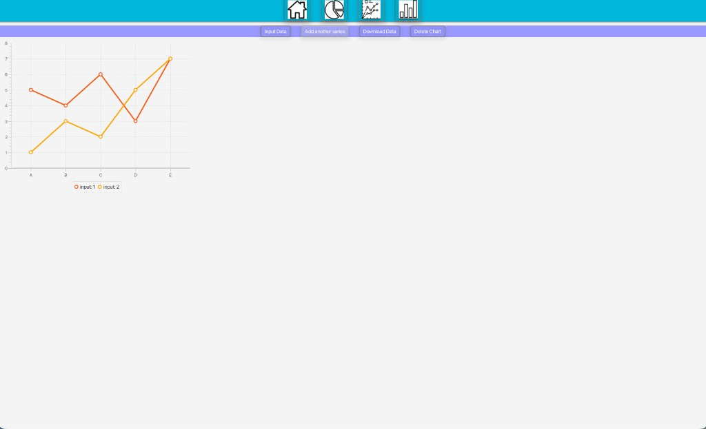

# GeoCal

A desktop geometry visualization and graphing application built with JavaFX. Draw points, lines, circles, and polygons on an interactive coordinate plane, plot functions, and build basic statistical charts.



## About

GeoCal is a Java desktop app originally developed as a **two-person team project** for a first-year **Object-Oriented Programming** course (2020–2021). The codebase was later restored with Maven and Java 17 in 2026.

## Key features

- **Scalable 2D coordinate system** — pannable graph paper with scroll-to-zoom and axis labels that adapt across scales
- **Interactive geometry construction** — points, segments, lines, rays, circles, and polygons drawn directly on the grid
- **Dependent geometry** — midpoints, projections, and reflections stay linked and update when parent shapes move
- **Shape & point management** — sidebar lists with color pickers, tabs for shapes vs. points, and a details panel
- **Live coordinate readout** — cursor position and selected-shape properties shown in real time
- **Function graphing** — plot custom `f(x)` expressions (trig, log, power, root, absolute value, etc.)
- **Statistical charts** — pie, line, and bar charts with data input, multi-series support, and export
- **Three-app-in-one** — Graph (geometry), Function (plotting), and Stat (charts) modes from a single home screen

## Tech stack

<p align="left">
  <a href="https://adoptium.net/" title="Java 17"></a>&nbsp;
  <a href="https://openjfx.io/" title="JavaFX"></a>&nbsp;
  <a href="https://github.com/jfoenixadmin/JFoenix" title="JFoenix"></a>&nbsp;
  <a href="https://maven.apache.org/" title="Maven"></a>
</p>

| | Technology | Version | Role |
|:--:|------------|---------|------|
|  | **Java** | 17 | Language / runtime |
|  | **JavaFX** | 17.0.15 | UI, charts, graphics |
|  | **JFoenix** | 9.0.10 | Material-style controls |
|  | **Maven** | wrapper (`./mvnw`) | Build and dependencies |

## Features

### Geometry canvas

Interactive graph paper with draggable/zoomable axes. Place points, draw circles, segments, lines, rays, and polygons directly on the grid.



### Shape list and color controls

The left sidebar lists every shape and point you create. Each entry has a **color picker** so you can change stroke or fill color. Use the **Shapes** and **Points** tabs to switch between object types.


### Shape details and mouse coordinates

The right sidebar shows live **mouse coordinates** as you move over the canvas, a **One touch?** toggle, and a **Shape Details** panel. Click a shape in the list (or double-click a circle on the canvas) to view its name, type, and coordinates.



### Function plotting

From the home screen, open **Function** to graph mathematical expressions on the coordinate plane. Type a custom `f(x)=` expression or pick a preset (trig, log, power, etc.), then click **Draw**.



### Statistics

From the home screen, open **Stat** to create pie, line, and bar charts from entered data. Use **Input Data** to add items, **Add Data** / **Add another series** for more entries, and **Download Data** to export.





## Tools

GeoCal has three main modes from the home screen: **Graph** (geometry), **Function** (plotting), and **Stat** (charts). In Graph mode, pick a top-toolbar category to open its submenu in the left sidebar, then choose a specific tool.

### Graph mode — top toolbar

| Tool | Description |
|------|-------------|
| **Home** | Return to the main menu |
| **Point** | Opens point construction tools (see below) |
| **Line** | Opens line construction tools (see below) |
| **Circle** | Opens circle construction tools (see below) |
| **Rectangle** | Toolbar button present; not wired up in the current build |
| **Polygon** | Click vertices on the grid to build a polygon from connected segments |
| **Clear** | Remove all shapes and points from the canvas |

**One touch?** (right sidebar): when enabled, the active tool stays selected so you can place the same construction repeatedly without re-picking it.

### Point tools

| Tool | How to use |
|------|------------|
| **Free point** | Click anywhere on the grid to place a labeled point |
| **Midpoint** | Click two existing or new points; creates the midpoint (updates if the parent points move) |
| **Projection** | Click a line or segment, then a point; creates the foot of the perpendicular from that point onto the line |
| **Reflection** | Click a line or segment, then a point; creates the point reflected across that line |
| **Pivot** | Click two points; the second point follows the first when either is moved |

### Line tools

| Tool | How to use |
|------|------------|
| **Segment** | Click two points to draw a finite line segment between them |
| **Line** | Click two points to draw an infinite line through them |
| **Ray** | Click two points to draw a ray starting at the first through the second |

### Circle tools

| Tool | How to use |
|------|------------|
| **Center + point** | Click center, then a point on the circumference (radius follows both points) |
| **Diameter (2 points)** | Click two endpoints of a diameter; center is the midpoint |
| **Three points** | Click three points on the circumference; circle is fitted through them |
| **Center + radius (input)** | Opens a dialog to enter center coordinates and radius numerically |

### Polygon tool

Click successive vertices on the grid. Each click adds a segment from the previous point; after three or more vertices, segments connect back to the first point to close the shape.

### Function mode tools

| Tool | Description |
|------|-------------|
| **Custom `f(x)=`** | Type any expression and click **Draw** |
| **Presets** | Quick-fill buttons: `sin(x)`, `cos(x)`, `tan(x)`, `cot(x)`, `sec(x)`, `cosec(x)`, `log2(x)`, `log10(x)`, `ln(x)`, `x^2`, `sqrt(x)`, `x^3`, `abs(x)`, `e^x` |
| **Clear** | Remove all plotted functions from the canvas |
| **Exit** | Return to the home screen |

### Stat mode tools

Top toolbar: **Home**, **Pie chart**, **Line chart**, **Bar chart**.

Each chart type opens a secondary toolbar:

| Chart | Actions |
|-------|---------|
| **Pie** | Input Data, Add Data, Download Data, Delete |
| **Line** | Input Data, Add another series, Download Data, Delete Chart |
| **Bar** | Input Data, Add another data, Download Data, Delete Chart |

### Legacy tools (not in current build)

The `legacy/` folder contains older rectangle and triangle modules (`GeoRect`, `Triangle`, `GeoPoly`) that were part of an earlier UI refactor and are not compiled into the app today.

## Prerequisites

- **JDK 17+** ([Temurin](https://adoptium.net/) or `brew install openjdk@17`)

No separate Maven install is required — the project includes `./mvnw`.

## Getting started

Clone the repository and run:

```bash
git clone <your-repo-url>
cd GeoCal

# Download dependencies (JavaFX, JFoenix, etc.)
./mvnw dependency:resolve

# Compile and launch the app
./mvnw javafx:run
```

On Windows, use `mvnw.cmd` instead of `./mvnw`.

Compile only:

```bash
./mvnw compile
```

## Project structure

```
GeoCal/
├── geocal/              # Java source (main class: geocal.GeoCal)
├── img/                 # UI assets (icons, CSS backgrounds)
├── docs/screenshots/    # README screenshots
├── legacy/              # Older geometry modules (not compiled)
├── pom.xml              # Maven build config
└── mvnw                 # Maven Wrapper
```

## Screenshots

### Geometry (Graph mode)

| Full workspace | Geometry construction |
|----------------|----------------------|
|  |  |

| Coordinate readout |
|--------------------|
|  |

### Function plotting

| Custom expression graph |
|-------------------------|
|  |

### Statistics (Stat mode)

| Pie chart | Line chart |
|-----------|------------|
|  |  |
